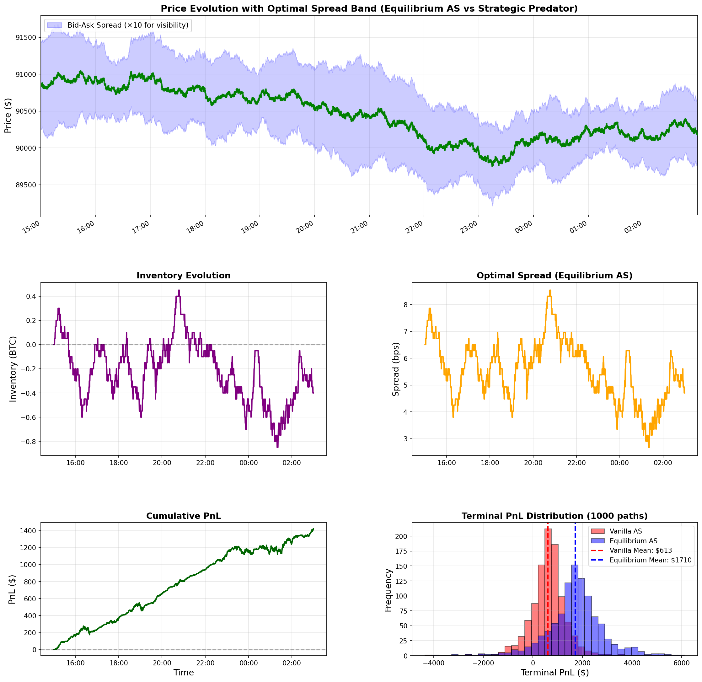

# Adversarial Avellaneda-Stoikov
A simulation for adversarial Avellaneda-Stoikov optimal inventory control with BTC as an example:

with the library for derivatives pricing, calibration, and reinforcement learning-based hedging strategies.

## Overview

This repository implements a comprehensive framework for option pricing, stochastic process simulation, model calibration, and advanced hedging strategies including deep hedging and adversarial methods.

## Key Components

### Stochastic Processes (`src/processes/`)
- Geometric Brownian Motion (GBM)
- Heston Stochastic Volatility
- Jump-Diffusion Models (Merton, Kou, Variance Gamma, NIG)
- Regime-Switching Models
- Levy Processes
- Mean-Reverting Processes (Ornstein-Uhlenbeck, CIR, CEV)
- Multi-Asset Models (Heston, Correlated GBM)
- SABR Model

### Derivatives (`src/derivatives/`)
- Vanilla Options (European, American)
- Path-Dependent Options (Asian, Barrier, Lookback)
- Multi-Asset Options (Basket, Rainbow, Spread)
- Interest Rate Derivatives (Bonds, Swaps, Caps/Floors)

### Pricing Methods (`src/pricer/`)
- Analytical Solutions (Black-Scholes, Heston)
- Monte Carlo Simulation
- Finite Difference Methods
- Fourier Transform Methods
- Finite Element Methods

### Calibration (`src/calibration/`)

**Physical Measure (P-Measure)**
- GBM Calibration
- Ornstein-Uhlenbeck Calibration
- Regime-Switching Calibration

**Risk-Neutral Measure (Q-Measure)**
- Heston Model Calibration
- Regime-Switching Heston Calibration
- Synthetic Option Chain Generation


### Hedging Strategies (`src/deep_hedging/`, `src/ais_hedging/`)
- Deep Hedging with Neural Networks
- Adversarial Hedging
- Reinforcement Learning-based Market Making

### Market Making (`src/market_making/`)
- Avellaneda-Stoikov Market Making
- Reinforcement Learning Market Making Strategies


## Usage

### Example: Synthetic Option Chain Generation

```python
from calibration.data import SyntheticOptionChainGenerator, RegimeVolatilityProfile

# Define volatility profile
vol_profile = RegimeVolatilityProfile(
    regime_id=0,
    regime_name='Normal Vol',
    kappa=4.0,
    theta=0.09,
    xi=0.5,
    rho=-0.7,
    v0=0.09,
    atm_iv=0.30,
)

# Generate option chains
generator = SyntheticOptionChainGenerator(
    regime_vol_profiles={0: vol_profile}
)

chain = generator.generate_single_chain(
    reference_date=date.today(),
    spot_price=50000.0,
    vol_profile=vol_profile,
)
```


## Project Structure

```
adversarial_avellaneda_stoikov/
├── src/
│   ├── processes/         # Stochastic process models
│   ├── derivatives/       # Derivative instruments
│   ├── pricer/            # Pricing engines
│   ├── calibration/       # Model calibration
│   │   ├── physical/      # P-measure calibration
│   │   ├── risk_neutral/  # Q-measure calibration
│   │   └── data/          # Data providers
│   ├── deep_hedging/      # Deep learning hedging
│   ├── ais_hedging/       # Adversarial hedging
│   └── market_making/     # Market making strategies
├── tests/                 # Unit tests
├── .gitignore
├── README.md
└── LICENSE
```

## Key Features

- Model-driven synthetic option chain generation using Heston characteristic function
- Comprehensive stochastic process library with regime-switching capabilities
- Crypto-focused data fetchers (Kraken, Yfinance) with proper interval handling
- Reinforcement learning framework for dynamic hedging
- Market making strategies with adversarial training

## Experiments: Double-Layer Market Making Game

The `experiments/` directory contains a complete experimental pipeline for the **double-layer market making game** with regime switching and strategic predatory trading. This implements the theoretical framework from the research paper on games-in-games architecture.

### Quick Start

```bash
cd experiments

# Verify data files are present
python check_data.py

# Run full experimental pipeline (calibration → simulation)
python run_all.py
```

### Experimental Workflow

The experiments implement a **two-layer calibration → simulation pipeline** where calibrated parameters **automatically flow** into the counterfactual simulation:

```
┌─────────────────┐         ┌─────────────────┐
│ Kraken 30-min   │         │ Gemini Tick     │
│ OHLCV Data      │         │ Data            │
└────────┬────────┘         └────────┬────────┘
         │                           │
         ▼                           ▼
┌─────────────────┐         ┌─────────────────┐
│ Layer 1: Regime │         │ Layer 2: Micro- │
│ Calibration     │         │ structure Calib │
│                 │         │                 │
└────────┬────────┘         └────────┬────────┘
         │                           │
         │ SAVES                    │ SAVES
         ▼                           ▼
    regime_parameters.csv    microstructure_parameters.csv
         │                           │
         └───────────┬───────────────┘
                     │ AUTO-LOADS
                     ▼
         ┌───────────────────────┐
         │ Counterfactual        │
         │ Simulation            │
         │                       │
         │ Vanilla AS vs         │
         │ Equilibrium AS        │
         └───────────────────────┘
```

#### Layer 1: Regime Calibration (Macro)
**Script:** `calibration/btc_regime_calibration.py`

Calibrates regime-switching parameters from **Kraken BTC-USD 30-minute OHLCV data**:

**Output:** `results/regime_parameters.csv`

#### Layer 2: Microstructure Calibration (Micro)
**Script:** `calibration/gemini_microstructure_calibration.py`

Calibrates order flow from **Gemini BTC-USD tick data**:
- Base arrival rate: λ₀ = 250,000/year (~42 trades/hour)
- Spread sensitivity: κ = 10.0 for λ(δ) = λ₀·exp(-κδ)
- Assumes 1/1000 market share for individual MM
- Average trade size: 0.05 BTC

**Output:** `results/microstructure_parameters.csv`

#### Counterfactual Simulation
**Script:** `adversarial_as/demo_counterfactual_simulation.py`

Compares two market making strategies facing a **strategic predatory trader** over 12 hours (1,000 Monte Carlo paths):

**Vanilla AS** (unaware of predator):

**Equilibrium AS** (aware of predator):


**Key Results:**

| Metric | Vanilla AS | Equilibrium AS | Improvement |
|--------|-----------|----------------|-------------|
| Mean PnL | $1,436 | $3,032 | **+111%**  |
| Sharpe Ratio | 0.775 | 1.223 | **+58%** |
| Avg Spread | 3.20 bps | 5.55 bps | +73% |

Equilibrium achieves **more than double the profit** by quoting 73% wider spreads that compensate for predatory risk.

**Outputs:**
- `results/counterfactual_simulation_results.png` - 6-panel visualization (price, inventory, spreads, PnL, distributions)
- `results/counterfactual_simulation_summary.csv` - Performance metrics
- `results/example_trajectory.csv` - Single trajectory details

The simulation script automatically loads parameters from CSV files created by calibration:

### Three Ways to Run

**Option 1: Full Pipeline** (recommended for reproducibility)
```bash
python run_all.py
```
Executes: Regime calibration → Microstructure calibration → Simulation with auto-loaded parameters

**Option 2: Simulation Only** (uses default parameters)
```bash
python adversarial_as/demo_counterfactual_simulation.py
```
Useful for testing parameter changes without re-running calibration

**Option 3: Step-by-Step**
```bash
# Step 1: Calibrate regimes (creates regime_parameters.csv)
python calibration/btc_regime_calibration.py

# Step 2: Calibrate microstructure (creates microstructure_parameters.csv)
python calibration/gemini_microstructure_calibration.py

# Step 3: Run simulation (auto-loads CSVs from steps 1 & 2)
python adversarial_as/demo_counterfactual_simulation.py
```

### Required Data Files

Two data files must be present in project root (verified with `check_data.py`):
- `kraken_btcusd_30m_7d.csv` - Kraken 30-min OHLCV (Dec 7-14, 2025)
- `gemini_btcusd_full.parquet` - Gemini tick data (Dec 14, 2025)
